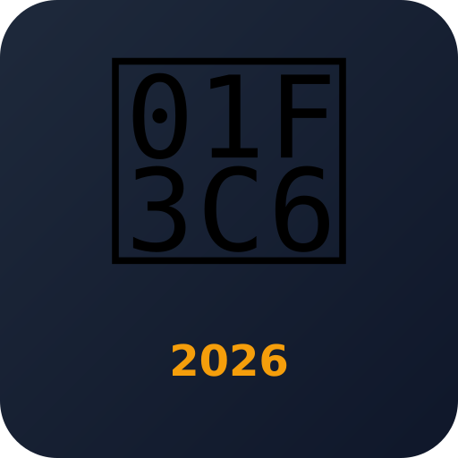

<div align="center">
  <h1>🏆 Copa do Mundo 2026</h1>
  <p><strong>Tabela de grupos, fase final, estatísticas e jogos ao vivo</strong></p>
  <p>
    <a href="https://ivansouza.github.io/copa/">📱 Acessar o App</a>
  </p>
  <br>
  
</div>

---

## 📋 Sobre

Aplicativo web progressivo (PWA) com a tabela completa da **Copa do Mundo FIFA 2026** — Estados Unidos, México e Canadá.

Dados em tempo real via **ESPN API**, sem necessidade de cadastro ou chave de API.

## ✨ Funcionalidades

| | |
|---|---|
| 📊 **Fase de Grupos** | 12 grupos (A-L) com classificação, pontos, saldo de gols |
| 🏅 **Fase Final** | Bracket visual completo: Segunda Fase (32) → Oitavas → Quartas → Semi → Final |
| 🌟 **Simulação de Favorito** | Escolha um time e veja o caminho simulado até a final |
| 🚫 **Times Eliminados** | Times já eliminados ficam desabilitados e não avançam na simulação |
| 📅 **Jogos** | Todos os jogos com data, horário de Brasília e local |
| ✅ **Encerrados** | Jogos realizados com placar final, gols e autores |
| 🔴 **Ao vivo** | Placar pulsante em verde para jogos em andamento |
| 🔍 **Filtro** | Busque por qualquer time para ver apenas seus jogos |
| 🎯 **Filtro por status** | Encerrados, ao vivo ou programados |
| 📈 **Estatísticas** | Ataque, defesa, artilheiros e ranking de times |
| 📺 **Cazé TV** | Transmissões, reacts e conteúdos ao vivo da Cazé TV no YouTube |
| 🔄 **Auto-atualização** | Dados atualizados a cada 3 minutos |
| 📲 **PWA** | Instalável na tela inicial do celular |
| 🌙 **Dark mode** | Tema escuro para não cansar a vista |

## 🚀 Como usar

### Online
Acesse **[https://ivansouza.github.io/copa/](https://ivansouza.github.io/copa/)**

### Instalar no celular (Android)
1. Abra o link no **Chrome**
2. Toque no menu ⋮
3. Selecione **"Adicionar à tela inicial"**
4. Pronto! Vira um app na sua home screen

### Instalar no celular (iOS)
1. Abra o link no **Safari**
2. Toque no ícone de compartilhar 📤
3. Role e selecione **"Adicionar à Tela de Início"**

## 🛠️ Tecnologias

- HTML5 + CSS3 + JavaScript (vanilla)
- CSS Grid + Flexbox
- Service Worker (cache offline de assets)
- Web App Manifest (PWA)
- API: [ESPN](https://www.espn.com/soccer/scoreboard)

## 📁 Estrutura

```
├── index.html        # App principal
├── manifest.json     # Manifest PWA
├── sw.js            # Service Worker
├── icon-192.png     # Ícone 192px
├── icon-512.png     # Ícone 512px
└── icon.svg         # Ícone vetorial
```

---

<div align="center">
  <p>Feito com 🐶 por <a href="https://github.com/ivansouza">Ivan Souza</a> e <strong>ZePequeno</strong></p>
</div>
